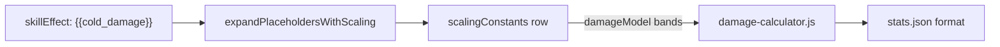

# Damage ranges (D2-style bands)

How min–max damage lines like `Cold Damage: 12-28` are computed and authored in MedianDB.

## Overview

Skill tooltips use placeholders such as `{{cold_damage}}` or `{{fire_damage}}`. The display format comes from `public/tree_data/stats.json` (for example `Cold Damage: {value0}-{value1}`).

There are two ways to supply the numbers:

| Mode | When | Data source |
|------|------|-------------|
| **Formula** (default) | Most skills today | `value0` / `value1` in `scalingConstants` or per-level `scaling` rows — evaluated by `FormulaEvaluator` |
| **Bands** (opt-in) | Vanilla D2-style min/max scaling | `damageModel: "bands"` on a `scalingConstants` row — computed by `src/skills/domain/damage-calculator.js` |

Band mode does not replace the placeholder system. It only changes how `value0` and `value1` are filled before the usual format string is applied.

## Where it runs

Placeholder expansion happens in `src/shared/utils.js` (`expandPlaceholdersWithScaling`). When a scaling row has `damageModel: "bands"` and the stat is a supported damage key, the app:

1. Loads the row via `Skill.getScalingValues()` (from `skills.json` `scalingConstants` and/or balance `scaling` tables).
2. Evaluates optional `synergyFormula` with `FormulaEvaluator` (`blvl`, `slvl`, `lvl`, `ulvl`, etc.).
3. Calls `calculateBandDamageMinMax()` for min and max.
4. Renders the result through `formatScalingValuesToDescriptionHtml()` and `stats.json` format.

Used in planner tooltips, skills index, patch notes, and anywhere else that expands `{{*_damage}}` placeholders.



## Supported stat keys

Band mode only applies to these placeholders (see `isBandDamageStatKey` in `damage-calculator.js`):

- `cold_damage`
- `fire_damage`
- `lightning_damage`
- `magic_damage`
- `physical_damage`
- `poison_dot` (min/max only; duration in `value2` still uses the normal formula path unless extended later)

Other stats (`weapon_damage`, `fire_spell_damage`, etc.) are unchanged.

## Authoring: `scalingConstants` row

Add or extend an object in `public/tree_data/<version>/skills.json` under the skill’s `scalingConstants` array.

### Required for band mode

| Field | Type | Description |
|-------|------|-------------|
| `statKey` | string | Must match the placeholder, e.g. `cold_damage` for `{{cold_damage}}` |
| `occurrenceIndex` | number | `0` for first `{{stat}}` of that key on the skill, `1` for second, etc. |
| `damageModel` | string | Set to `"bands"` to enable band calculator |
| `damageKind` | string | `"elemental"` or `"physical"` (selects min/max column semantics; both use the same band math) |
| `baseMin` | number | Damage at skill level 1 (vanilla `EMin` / `MinDam`) |
| `baseMax` | number | Max at level 1 (vanilla `EMax` / `MaxDam`) |
| `minPerLevel` | number[5] | Added damage per level in each band, for **min** |
| `maxPerLevel` | number[5] | Added damage per level in each band, for **max** |

### Optional

| Field | Type | Default | Description |
|-------|------|---------|-------------|
| `variantKey` | string | `""` | Variant-specific row when the skill has variants |
| `hitShift` | number | `8` | Display scale in 256ths: final damage is multiplied by `2^(hitShift - 8)` after synergy |
| `synergyFormula` | string | (none) | Formula returning **extra percent**; multiplier is `(100 + result) / 100`. Uses existing syntax: `skill('x'.blvl)`, `par*`, `calc1`, etc. |

There is **no** `elementType` field. Element behavior (e.g. lightning min quirk) is inferred from skill **tags**, with a fallback from `statKey` (see below).

### Example (`abyss`, patch 2.13)

```json
{
  "statKey": "cold_damage",
  "occurrenceIndex": 0,
  "variantKey": "",
  "damageModel": "bands",
  "damageKind": "elemental",
  "baseMin": 4,
  "baseMax": 8,
  "minPerLevel": [1, 1, 2, 2, 3],
  "maxPerLevel": [2, 2, 3, 4, 5],
  "hitShift": 8,
  "synergyFormula": "0"
}
```

Skill tags: `["Cold", "Spell"]`. Tooltip line: `{{cold_damage}}` → format from `stats.json` → `Cold Damage: {value0}-{value1}`.

At skill level 1, min = 4 and max = 8. At higher levels, band increments apply (see next section).

## Level bands

Band increments follow vanilla D2 skill level breakpoints (same as `calc1`–`calc6` buckets in `src/skills/domain/calc-buckets.js`):

| Band index | Skill levels | `minPerLevel[i]` / `maxPerLevel[i]` |
|------------|--------------|-------------------------------------|
| 0 | 2–8 | index 0 |
| 1 | 9–16 | index 1 |
| 2 | 17–22 | index 2 |
| 3 | 23–28 | index 3 |
| 4 | 29+ | index 4 |

Level 1 uses only `baseMin` / `baseMax`; no band increment is applied until level exceeds 1.

**Skill level** for the calculation is `lvl = blvl + slvl` (allocated points plus +skills), same as mana cost and other formulas. Subskills mirror parent `blvl`/`slvl` when expanding placeholders.

### Calculation order (per min or max)

1. Start at `baseMin` or `baseMax`.
2. For each band, add `(levels in band) × perLevel[i]`.
3. Multiply by synergy: `trunc(value × synergyMultiplier)`.
4. Apply `hitShift`: `trunc(value × 2^(hitShift - 8))`.

All intermediate values are truncated to integers (`Math.trunc`), matching D2-style integer math.

### `hitShift` reference

| `hitShift` | Multiplier on displayed damage |
|------------|--------------------------------|
| 8 | 100% (default) |
| 7 | 50% |
| 9 | 200% |

Same idea as `manashift` on `{{mana_cost}}` rows.

## Element type (tags, not JSON)

Used only for special rules (not for the visible label — that comes from `statKey` + `stats.json`).

`inferElementTypeFromSkill(skill, statKey)` in `damage-calculator.js`:

1. **Tags first** — map `Cold`, `Fire`, `Lightning`, `Magic`, `Poison`, `Physical` on the skill catalog row.
2. If multiple elemental tags match, prefer the tag that matches the placeholder (`{{cold_damage}}` + `Cold` → `cold`).
3. **Fallback** — derive from `statKey` (`fire_damage` → `fire`) when tags are missing.

### Lightning minimum

If element is lightning, `baseMin === 1`, and all five `minPerLevel` entries are `0`, displayed **min** stays **1** (vanilla quirk). Max uses normal band math.

## Synergy

`synergyFormula` is optional. When present and evaluates successfully:

```text
synergyMultiplier = (100 + formulaResult) / 100
```

Example vanilla-style expression (not used in Median data unless you author it):

```text
(skill('fire_bolt'.blvl) + skill('meteor'.blvl)) * par8
```

Median has no fire/lightning **mastery** pass; do not expect `enma`/`exma`-style display splits from vanilla D2.

## Formula mode (default)

If `damageModel` is omitted or anything other than `"bands"`, behavior is unchanged:

- `value0` / `value1` (and constants) are formulas or numbers evaluated per level.
- Example: `lightning_damage` with `value0: "(1*ulvl)*(0.7+0.3*blvl)"`.

Skills that mention `{{cold_damage}}` but have **no** matching `scalingConstants` row still show `???` for that line.

## Code map

| File | Role |
|------|------|
| `src/skills/domain/damage-calculator.js` | Band loop, `hitShift`, synergy, tag inference, lightning min |
| `src/shared/utils.js` | `expandPlaceholdersWithScaling` — band branch next to `mana_cost` |
| `src/skills/domain/Skill.js` | Passes band metadata through `_mergeConstants` |
| `src/tree/skill-data-store.js` | Forwards band fields from JSON rows |
| `public/tree_data/stats.json` | Display names and `{value0}-{value1}` formats |
| `src/editor/editor-store.js` | Default scaling row template includes optional band fields (dev editor) |

## References (vanilla D2)

- [D2R Data Guide](https://locbones.github.io/D2R_DataGuide/) — `EMin`/`EMax`, `*Lev1..5`, `HitShift`, `EDmgSymPerCalc`
- [blizzhackers/d2data](https://github.com/blizzhackers/d2data) — JSON skill columns
- [d2planner damageCalculators.js](https://github.com/d2planner/skills/blob/main/d2planner/src/damageCalculators.js) — reference implementation Median band math was adapted from (without elemental mastery)
